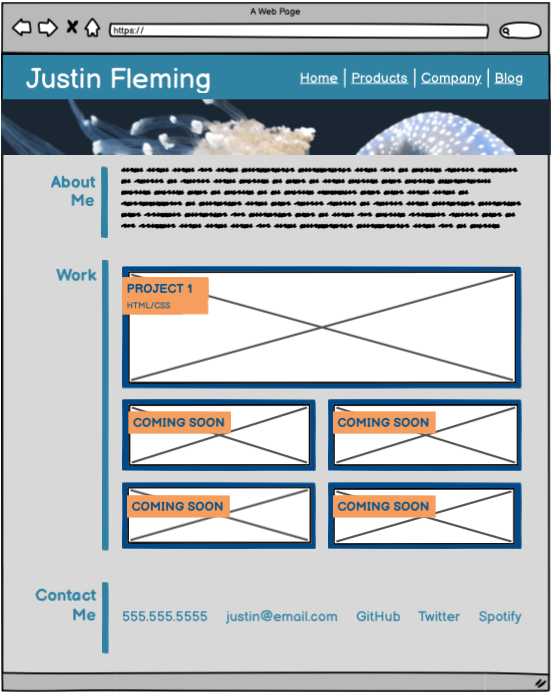
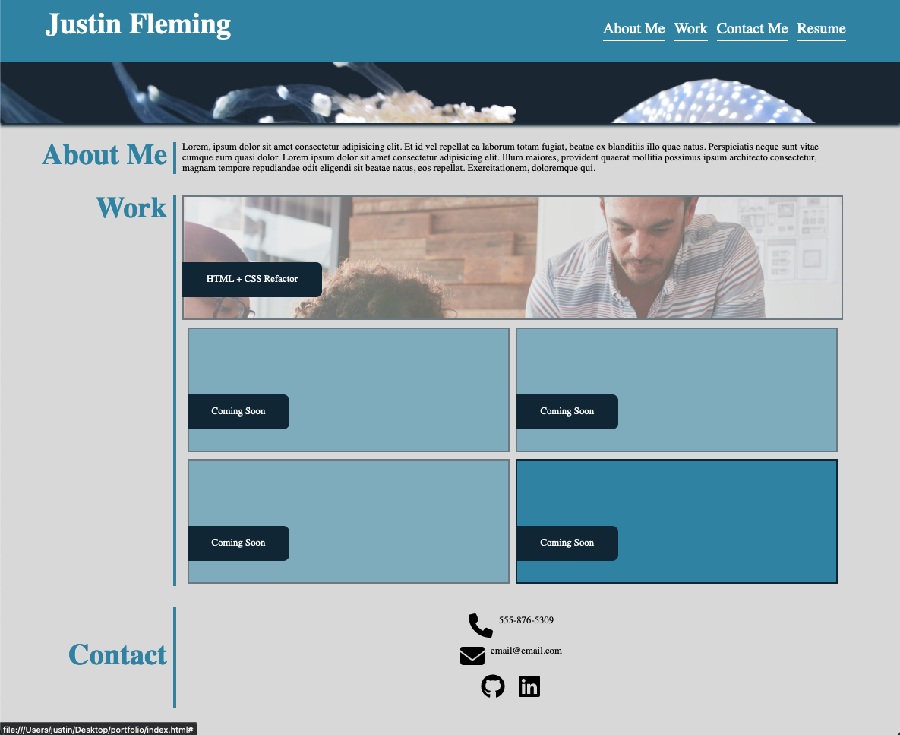

# portfolio

## Description

I went to school for mechanical engineering, but I have since found a passion for coding. I'm now pursing my goal to be a professional web developer.

This is my professional profolio, where I will link all my current and future projects.

## Usage

This site was wireframed using Balsamiq Wireframes software.

### Wireframe

### Finished Product

## Credits

List your collaborators, if any, with links to their GitHub profiles.

If you used any third-party assets that require attribution, list the creators with links to their primary web presence in this section.

If you followed tutorials, include links to those here as well.

## License

 

