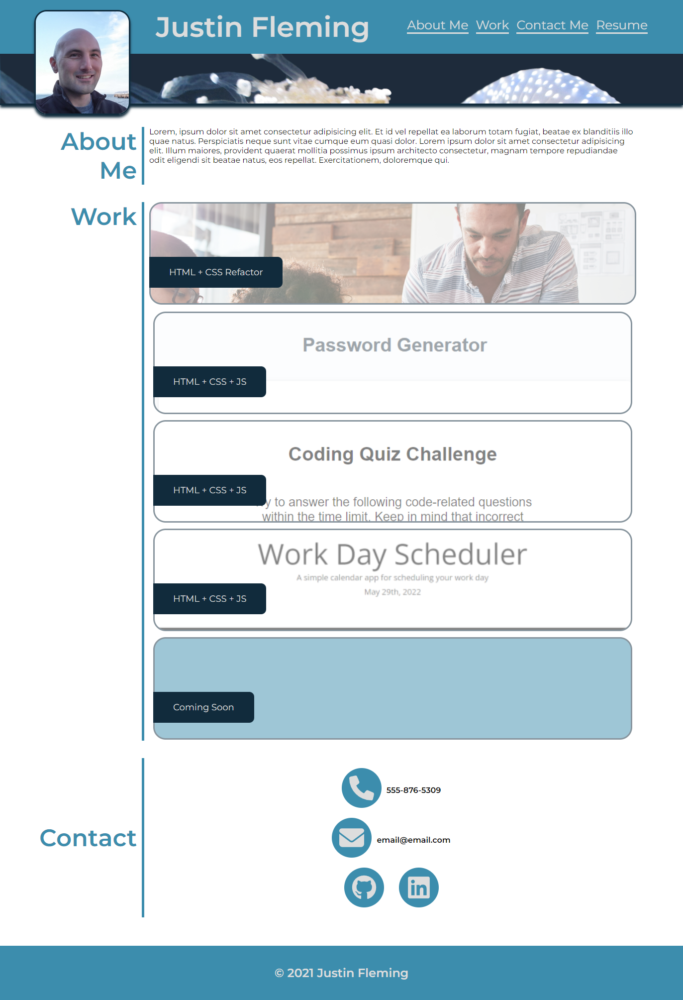

# portfolio

## Description

I went to school for mechanical engineering, but I have since found a passion for coding. I'm now pursuing my goal to be a professional web developer.

This is my professional profolio, where I will link all my current and future projects.

## Usage

This site was wireframed using Balsamiq Wireframes software.

### Wireframe

### Finished Product

## Credits

### Software Used
Balsamiq Wireframes, MS VSCode, 

### Others content used
Google Fonts, Font Awesome

I take credit for designing and creating this website.

## License

 

